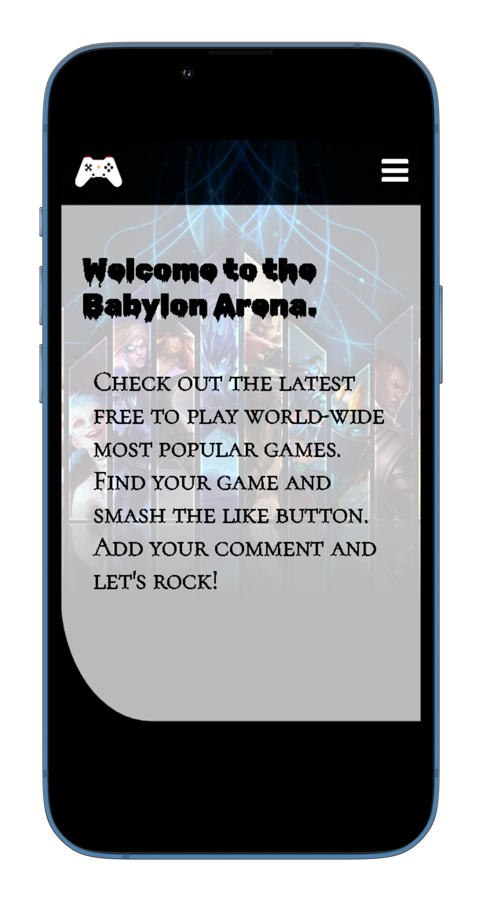
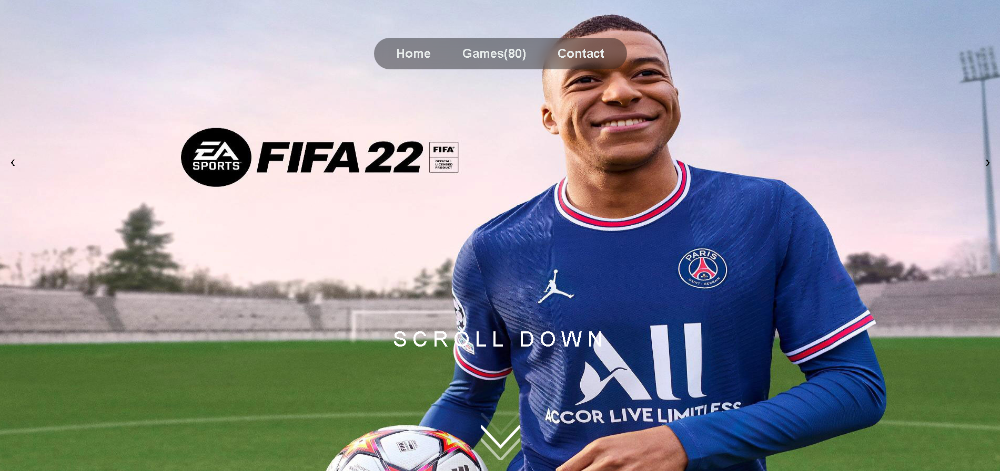
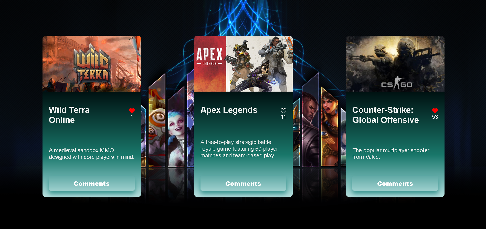

# Free-To-Play Games

> This is the JavaScript capstone project, which is based on an external API, called FreeToGame API. The data of the games, which is fetched from the API, it gets displayed on the cards. The user can leave a comment on the game cards and give it a like also.

#### [Live Demo Link](https://saidrasinlic.github.io/Free-To-Play-Games/)


## Built With

- HTML
- CSS/SCSS
- JavaScript
- Modules
- Webpack
- Jest test

## Screenshot
### Mobile



### Desktop




## Getting Started

To get a local copy up and running follow these simple example steps.

### Prerequisites

- browser (Google Chrome, Firefox)
- text editor (VSCode)
- terminal

### Setup

```
git clone git@github.com:virag-ky/Free-To-Play-Games.git
```
### Installation 

#### Install dependencies
```
npm install
```
#### Install Sass loader, webpack
```
npm install sass-loader sass webpack --save-dev
```

#### Install file-loader
```
npm install file-loader --save-dev
```
#### Install Jest
```
npm install jest
```
#### Install @babel/plugin-transform-modules-commonjs
```
npm install --save-dev @babel/plugin-transform-modules-commonjs
```
### Run the tests
```
npm test
```

### Build the app
```
npm run build
```

### Run the app

```
npm run dev
```


## Authors

👤 **Virag Kormozcy**

- GitHub: [@virag-ky](https://github.com/virag-ky)
- Twitter: [@Virag_Ky](https://twitter.com/Virag_Ky)
- LinkedIn: [virag-kormoczy](https://linkedin.com/in/virag-kormoczy)

👤 **Said Rašinlić**

- GitHub: [@SaidRasinlic](https://github.com/SaidRasinlic)
- Twitter: [@Virag_Ky](https://twitter.com/SaidRasinlic)
- LinkedIn: [virag-kormoczy](https://linkedin.com/in/SaidRasinlic)

## 🤝 Contributing

Contributions, issues, and feature requests are welcome!

Feel free to check the [issues page](../../issues/).

## Show your support

Give a ⭐️ if you like this project!

## 📝 License

This project is [MIT](./MIT.md) licensed.
